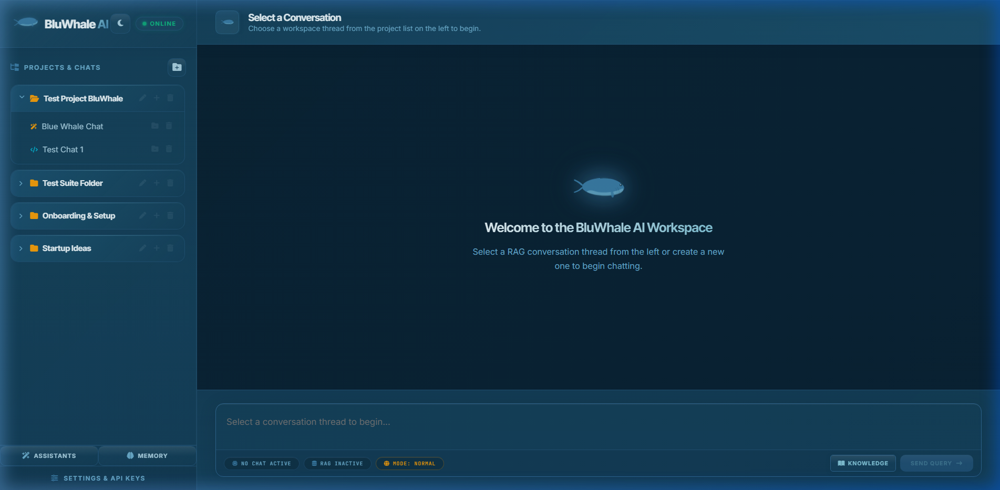
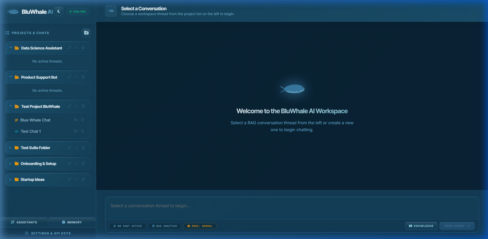
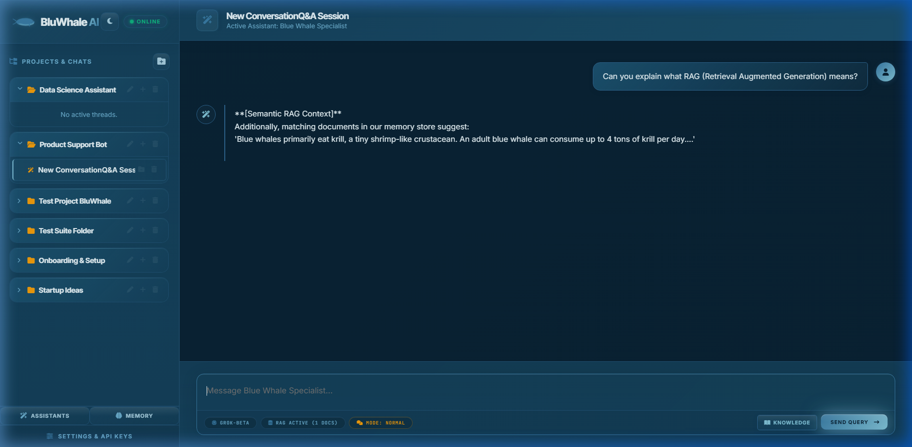
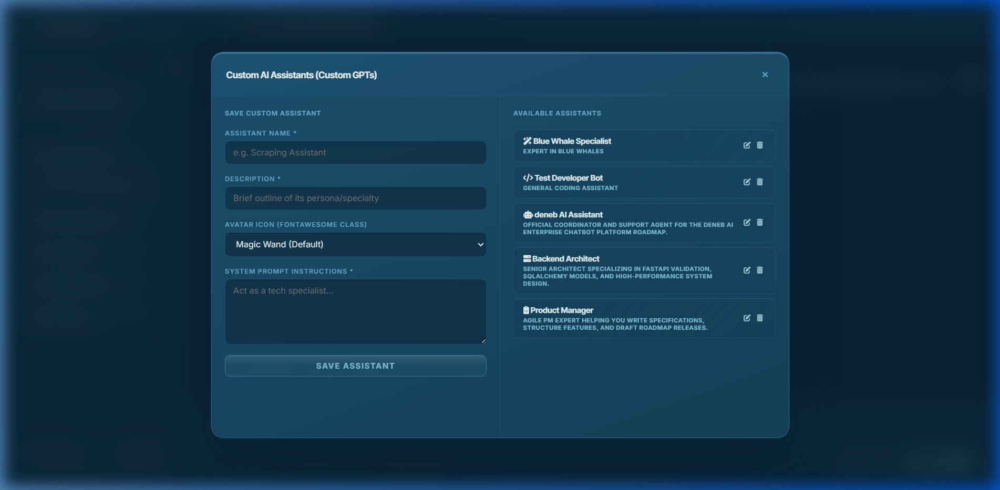
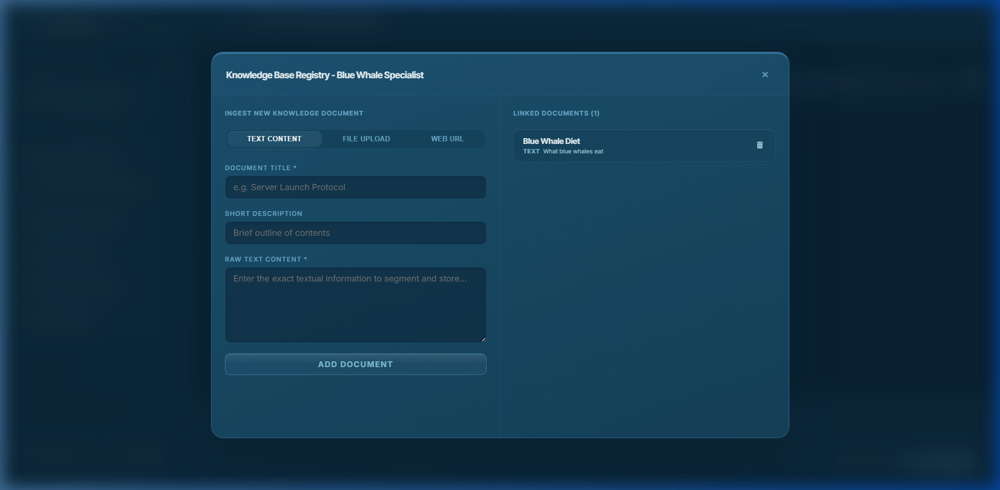
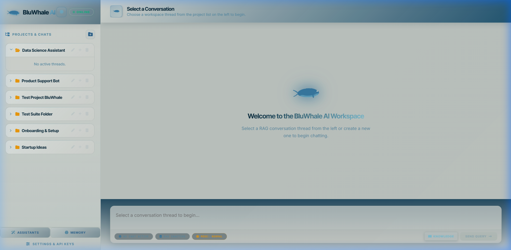
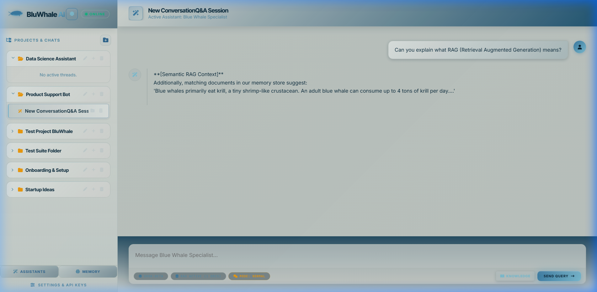

<!-- HEADER WAVE BANNER -->
<p align="center">
  
</p>

<!-- ANIMATED TYPING SUBTITLE -->
<p align="center">
  
</p>

<br>

<!-- NAVIGATION LINKS -->
<p align="center">
  <a href="#-about">About</a>&nbsp;&nbsp;·&nbsp;&nbsp;
  <a href="#-features">Features</a>&nbsp;&nbsp;·&nbsp;&nbsp;
  <a href="#-tech-stack">Tech Stack</a>&nbsp;&nbsp;·&nbsp;&nbsp;
  <a href="#-screenshots">Screenshots</a>&nbsp;&nbsp;·&nbsp;&nbsp;
  <a href="#-quick-start">Quick Start</a>&nbsp;&nbsp;·&nbsp;&nbsp;
  <a href="#-api-reference">API Docs</a>&nbsp;&nbsp;·&nbsp;&nbsp;
  <a href="#-running-tests">Tests</a>&nbsp;&nbsp;·&nbsp;&nbsp;
  <a href="#-architecture">Architecture</a>
</p>

<br>

<!-- SHIELD BADGES ROW 1 -->
<p align="center">
  
  
  
  
</p>

<!-- SHIELD BADGES ROW 2 -->
<p align="center">
  
  
  
  
</p>

<br>

---

## 🐋 About

**BluWhale AI** is a **production-grade, self-hosted AI Chatbot Control Center** — a complete workspace for building, organizing, and running intelligent assistants. Think of it as your own private ChatGPT-style workspace that you control entirely.

Connect it to **xAI Grok** for real LLM responses, or run in **offline simulation mode** with zero external dependencies. Either way, you get a fully working, feature-complete AI platform right out of the box.

> 🐋 *"BluWhale AI"* is the name of the platform. The whale is the brand identity — the product is a powerful, full-stack AI engine.

<br>

---

## ✨ Features

<table>
<tr>
<td width="50%" valign="top">

### 🧠 Core AI Engine
- **Multi-Assistant System** — Create named AI personas, each with its own system prompt, icon, and dedicated knowledge base
- **RAG (Retrieval Augmented Generation)** — Upload docs → AI retrieves the most relevant chunks to answer your questions
- **User Memory** — Automatically extracts and remembers facts about you across sessions (name, profession, preferences)
- **Web Search Mode** — Switch any conversation to live web search — AI answers with real-time sourced results
- **Canvas Artifact System** — AI-generated code/SQL/JSON is auto-captured into a document panel with copy & download

</td>
<td width="50%" valign="top">

### 🗂️ Workspace & Organization
- **Projects & Folders** — Group conversation threads into named project workspaces
- **Conversation Threads** — Each thread links to a specific assistant with its own message history
- **3 Chat Modes** — Switch per-conversation: `Normal` / `RAG` / `Web Search`
- **Cascade Delete** — Deleting a project cascades to all conversations, messages, and artifacts
- **Full Message History** — All messages persisted in SQLite with chronological retrieval.

</td>
</tr>
<tr>
<td width="50%" valign="top">

### 📚 Knowledge Base Ingestion
- 📄 **PDF Upload** — parsed with PyPDF, text extracted page-by-page.
- 📝 **TXT / Markdown** — direct file uploads.
- 🌐 **URL Scraping** — paste any public URL, content auto-scraped + cleaned
- ✏️ **Raw Text Paste** — direct text input.
- ⚙️ **Auto-Chunking** — 500-char recursive splitter, 50-char overlap

</td>
<td width="50%" valign="top">

### 🎨 Premium UI
- **Deep Blue Waters** design system — ocean-inspired dark/light themes
- **Animated BluWhale SVG** — swimming whale logo identity......
- **Glassmorphism** — frosted glass cards, panels, and modals
- **Pulsing send button** — animated ocean glow effect.
- **Textarea auto-grow** — expands as you type (up to 180px)
- **4-type toast system** — success / error / warning / info

</td>
</tr>
</table>

<br>

---

## 🛠️ Tech Stack

<p align="center">
  
</p>

<br>

<table align="center">
<tr>
<th>Layer</th>
<th>Technology</th>
<th>Role</th>
</tr>
<tr>
<td rowspan="7"><strong>⚙️ Backend</strong></td>
<td> Python 3.13</td>
<td>Core language</td>
</tr>
<tr>
<td> FastAPI</td>
<td>REST API framework — routing, validation, Swagger auto-docs, dependency injection</td>
</tr>
<tr>
<td> Uvicorn</td>
<td>ASGI server with hot-reload in development</td>
</tr>
<tr>
<td> SQLAlchemy 2.0</td>
<td>ORM — models, relationships, cascade deletes</td>
</tr>
<tr>
<td> SQLite</td>
<td>Local file database — zero-config, portable</td>
</tr>
<tr>
<td> Pydantic v2</td>
<td>Request/response schema validation & serialization</td>
</tr>
<tr>
<td> HTTPX + BS4 + PyPDF</td>
<td>HTTP client · Web scraper · PDF text extractor</td>
</tr>
<tr>
<td rowspan="3"><strong>🎨 Frontend</strong></td>
<td> HTML5</td>
<td>Single-page app structure</td>
</tr>
<tr>
<td> Vanilla CSS</td>
<td>Complete design system — variables, glassmorphism, animations, themes</td>
</tr>
<tr>
<td> Vanilla JS</td>
<td>All UI logic — API calls, DOM, state, modals, toasts</td>
</tr>
<tr>
<td><strong>🤖 LLM</strong></td>
<td> xAI Grok API</td>
<td>LLM completions (<code>grok-beta</code>, <code>grok-2</code>) with offline simulation fallback</td>
</tr>
<tr>
<td><strong>🧪 Testing</strong></td>
<td> Pytest + HTTPX</td>
<td>22 automated tests — CRUD, RAG, upload, chat, canvas, memory, projects</td>
</tr>
</table>

<br>

---

## 📸 Screenshots

> Dark and Light mode — both fully supported. Switch with one click, preference saved across sessions..

<br>

<table>
  <tr>
    <td align="center" width="50%">
      
      <br>
      <sub><b>🌊 Dark Mode — Welcome Screen</b></sub>
    </td>
    <td align="center" width="50%">
      
      <br>
      <sub><b>📁 Dark Mode — Projects & Conversations Tree</b></sub>
    </td>
  </tr>
  <tr>
    <td align="center" width="50%">
      
      <br>
      <sub><b>💬 Dark Mode — Active Chat with AI Response</b></sub>
    </td>
    <td align="center" width="50%">
      
      <br>
      <sub><b>🧠 Dark Mode — Assistants Manager Modal</b></sub>
    </td>
  </tr>
  <tr>
    <td align="center" width="50%">
      
      <br>
      <sub><b>📚 Dark Mode — Knowledge Base Ingestion</b></sub>
    </td>
    <td align="center" width="50%">
      
      <br>
      <sub><b>☀️ Light Mode — Welcome Screen</b></sub>
    </td>
  </tr>
  <tr>
    <td align="center" width="50%">
      
      <br>
      <sub><b>☀️ Light Mode — Active Chat Interface</b></sub>
    </td>
    <td align="center" width="50%">
      <br><br>
      <h3>🎨 Design System</h3>
      <p>Two complete themes.<br>One click to switch.<br>Preference saved forever.</p>
      <br>
      
      
    </td>
  </tr>
</table>

<br>

---

## ⚡ Quick Start

### Prerequisites

- **Python 3.10+** — [python.org](https://www.python.org/downloads/)
- **Git**

### 1️⃣ Clone

```bash
git clone https://github.com/Dhroovs/BluWhale-AI.git
cd BluWhale-AI
```

### 2️⃣ Virtual Environment

```bash
# Create
python -m venv venv

# Activate — Windows PowerShell
.\venv\Scripts\Activate.ps1

# Activate — macOS / Linux
source venv/bin/activate
```

### 3️⃣ Install Dependencies

```bash
pip install -r requirements.txt
```

### 4️⃣ Seed the Database *(optional but recommended)*

```bash
python seed_data.py
```

### 5️⃣ Start the Server

```bash
python main.py
```

> 🚀 Server starts at **`http://127.0.0.1:8000`**

### 6️⃣ Open the App.

```
http://127.0.0.1:8000/chat
```

<br>

### 🔑 API Keys

| Key | Purpose | Default |
|---|---|---|
| **App API Key** | Authenticates all REST API calls | `deneb-secret-key` |
| **Grok API Key** | Powers real xAI LLM responses | *(optional — falls back to simulation)* |

Enter both in the **Settings & API Keys** drawer inside the app. Get a Grok key at [console.x.ai](https://console.x.ai).

> **💡 No Grok key? No problem.** BluWhale AI runs in intelligent simulation mode — it still returns meaningful responses using RAG context and web search data. Nothing breaks.

<br>

### 🌐 Access Points

| URL | What It Is |
|---|---|
| [`/chat`](http://127.0.0.1:8000/chat) | 🎯 Main BluWhale AI interface |
| [`/docs`](http://127.0.0.1:8000/docs) | 📖 Interactive Swagger API explorer |
| [`/redoc`](http://127.0.0.1:8000/redoc) | 📋 ReDoc API documentation |
| [`/`](http://127.0.0.1:8000/) | 🔍 JSON root metadata block |

<br>

---

## 🔌 API Reference.

All endpoints require the `X-API-Key` header. All routes are prefixed with `/api/v1/`.

<details>
<summary><b>🤖 Chatbot Agents</b></summary>

```http
POST   /api/v1/chatbots/               Create chatbot agent
GET    /api/v1/chatbots/               List with search, filter, pagination
GET    /api/v1/chatbots/{id}           Get details
PUT    /api/v1/chatbots/{id}           Update (partial)
DELETE /api/v1/chatbots/{id}           Delete (cascades KB)
POST   /api/v1/chatbots/{id}/chat      Chat with Grok + RAG injection
POST   /api/v1/chatbots/{id}/simulate  Simulate RAG context retrieval
```

</details>

<details>
<summary><b>🧠 Assistants</b></summary>

```http
POST   /api/v1/assistants/     Create assistant persona
GET    /api/v1/assistants/     List assistants (paginated)
GET    /api/v1/assistants/{id} Get details
PUT    /api/v1/assistants/{id} Update
DELETE /api/v1/assistants/{id} Delete
```

</details>

<details>
<summary><b>📁 Projects & Conversations</b></summary>

```http
POST   /api/v1/projects                          Create project folder
GET    /api/v1/projects                          List projects (paginated)
PUT    /api/v1/projects/{id}                     Rename/update
DELETE /api/v1/projects/{id}                     Delete (cascade all)

POST   /api/v1/conversations                     Create conversation thread
GET    /api/v1/conversations                     List threads
PUT    /api/v1/conversations/{id}                Update/move/rename
DELETE /api/v1/conversations/{id}                Delete thread

GET    /api/v1/conversations/{id}/messages       Get message history
POST   /api/v1/conversations/{id}/messages       ✉️ Send chat message
GET    /api/v1/conversations/{id}/artifacts      List canvas artifacts
GET    /api/v1/artifacts/{id}                    Get single artifact
```

</details>

<details>
<summary><b>📚 Knowledge Base</b></summary>

```http
POST   /api/v1/knowledge-base/                             Create knowledge base
GET    /api/v1/knowledge-base/                             List all KBs
DELETE /api/v1/knowledge-base/{id}                         Delete KB
POST   /api/v1/knowledge-base/{id}/documents/text          Ingest raw text
POST   /api/v1/knowledge-base/{id}/documents/upload        Upload PDF/TXT file
POST   /api/v1/knowledge-base/{id}/documents/url           Scrape web page
DELETE /api/v1/knowledge-base/{kb_id}/documents/{doc_id}   Remove document
```

</details>

<details>
<summary><b>🧩 Memory</b></summary>

```http
GET    /api/v1/memories/       List memories (filter by category/search)
POST   /api/v1/memories/       Create memory entry
PUT    /api/v1/memories/{id}   Update memory
DELETE /api/v1/memories/{id}   Delete memory
```

</details>

<br>

---

## 🧪 Running Tests.

```bash
python -m pytest test_api.py test_advanced_features.py -v
```

<details>
<summary><b>📋 View Full Test Results (22/22 PASSED)</b></summary>

```
test_api.py::test_create_chatbot                              PASSED  ✅
test_api.py::test_create_chatbot_invalid_temp                 PASSED  ✅
test_api.py::test_create_chatbot_invalid_model                PASSED  ✅
test_api.py::test_get_chatbot_details                         PASSED  ✅
test_api.py::test_update_chatbot_details                      PASSED  ✅
test_api.py::test_delete_chatbot                              PASSED  ✅
test_api.py::test_list_chatbots_pagination_and_search         PASSED  ✅
test_api.py::test_create_knowledge_base                       PASSED  ✅
test_api.py::test_create_kb_invalid_chatbot                   PASSED  ✅
test_api.py::test_delete_chatbot_cascades_kb                  PASSED  ✅
test_api.py::test_api_key_verification                        PASSED  ✅
test_api.py::test_knowledge_base_auto_chunking                PASSED  ✅
test_api.py::test_file_upload_txt                             PASSED  ✅
test_api.py::test_file_upload_pdf                             PASSED  ✅
test_api.py::test_url_scraping_and_auto_scraping              PASSED  ✅
test_api.py::test_chat_simulation                             PASSED  ✅
test_api.py::test_chat_with_grok_fallback                     PASSED  ✅
test_api.py::test_chat_with_grok_mocked                       PASSED  ✅
test_advanced_features.py::test_assistant_crud                PASSED  ✅
test_advanced_features.py::test_memory_crud                   PASSED  ✅
test_advanced_features.py::test_project_and_conversation_workflow  PASSED  ✅
test_advanced_features.py::test_web_search_and_canvas_extraction   PASSED  ✅

========================= 22 passed in 4.14s =========================
```

</details>

<br>

---

## 🏗️ Architecture

### File Structure

```
BluWhale-AI/
│
├── 📄 main.py                     # FastAPI app — routes, static files, /chat
├── 📦 requirements.txt            # Python dependencies
├── 🌱 seed_data.py                # Database seeding script
├── 🧪 test_api.py                 # Core API tests (18 tests)
├── 🧪 test_advanced_features.py   # Advanced feature tests (4 tests)
│
├── 📁 app/
│   ├── ⚙️  config.py              # Settings: DB URL, API keys
│   ├── 📁 database/
│   │   └── connection.py          # SQLite engine + SessionLocal
│   ├── 📁 models/                 # SQLAlchemy ORM models
│   │   ├── chatbot.py             # Chatbot + KnowledgeBase + Chunk
│   │   ├── assistant.py           # Assistant model
│   │   ├── memory.py              # Memory model
│   │   └── project.py            # Project + Conversation + Message + Artifact
│   ├── 📁 schemas/                # Pydantic request/response schemas
│   ├── 📁 routes/                 # FastAPI route controllers
│   ├── 📁 services/
│   │   ├── ⭐ chat.py             # Main 11-step chat pipeline
│   │   ├── llm.py                 # Grok API + simulation fallback
│   │   ├── memory.py              # Memory CRUD + auto-extraction
│   │   └── search.py              # Web search provider
│   └── 📁 utils/
│       ├── extractor.py           # PDF + URL text extraction
│       ├── text_splitter.py       # Recursive document chunker
│       └── security.py           # API key auth dependency
│
├── 📁 static/
│   ├── index.html                 # Single-page app
│   ├── style.css                  # 2,400+ line design system
│   └── app.js                     # 1,350+ line frontend logic
│
└── 📁 docs/screenshots/           # 7 UI screenshots (dark + light)
```

### ⭐ The Chat Pipeline

Every message you send goes through an **11-step pipeline** (`app/services/chat.py`):

```
Step  1 ──▶ Load conversation + assistant from database
Step  2 ──▶ Auto-extract memory facts from user message
Step  3 ──▶ Retrieve top user memories → inject into system prompt
Step  4 ──▶ Score KB chunks by keyword overlap → inject top 2 (RAG)
Step  5 ──▶ Run web search if mode = 'web_search' → inject results
Step  6 ──▶ Build consolidated system prompt
              [assistant prompt] + [memory] + [RAG] + [search]
Step  7 ──▶ Load last 15 messages for conversation context window
Step  8 ──▶ Call LLMService → xAI Grok API (or simulation fallback)
Step  9 ──▶ Auto-extract code blocks → save as Canvas Artifacts
Step 10 ──▶ Persist user + assistant messages to database
Step 11 ──▶ Return payload: { response, sources, artifact, warning }
```

<br>

---

## 🎨 Design System — Deep Blue Waters

<p align="center">

| Token | Color | Hex | Usage |
|---|---|---|---|
| Primary |  Steel Blue | `#3a7ca5` | Buttons, logo, key borders |
| Accent |  Sky Blue | `#81c3d7` | Icons, hover glow, highlights |
| Surface |  Baltic Blue | `#16425b` | Cards, sidebar, panels |
| Background |  Ocean Dark | `#0a2233` | Main background |
| Text |  Ice White | `#e8f4f8` | Primary readable text |
| Success |  Emerald | `#10b981` | Status online, success toasts |

</p>

<br>

---

## 🔒 Security

```python
# Applied globally to all API routers via FastAPI dependency injection
async def verify_api_key(x_api_key: str = Header(..., alias="X-API-Key")):
    if x_api_key != settings.API_KEY:
        raise HTTPException(status_code=403, detail="Invalid API key")
```

Override defaults with environment variables:

```bash
export API_KEY=your-custom-key
export GROK_API_KEY=xai-your-grok-key
python main.py
```

<br>

---

## 📄 License

```
MIT License — Copyright (c) 2026 Dhroovs
Permission is granted to use, copy, modify, merge, publish, and distribute
this software freely, subject to the MIT license terms.
```

<br>

<!-- FOOTER WAVE -->
<p align="center">
  
</p>

<p align="center">
  <sub>Built with 🐋 and lots of ocean energy by <a href="https://github.com/Dhroovs"><strong>Dhroovs</strong></a></sub>
</p>

<p align="center">
  <a href="https://github.com/Dhroovs/BluWhale-AI/stargazers">
    
  </a>
  &nbsp;
  <a href="https://github.com/Dhroovs/BluWhale-AI/network/members">
    
  </a>
  &nbsp;
  <a href="https://github.com/Dhroovs/BluWhale-AI/issues">
    
  </a>
</p>
